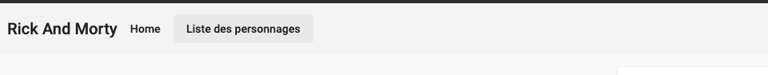
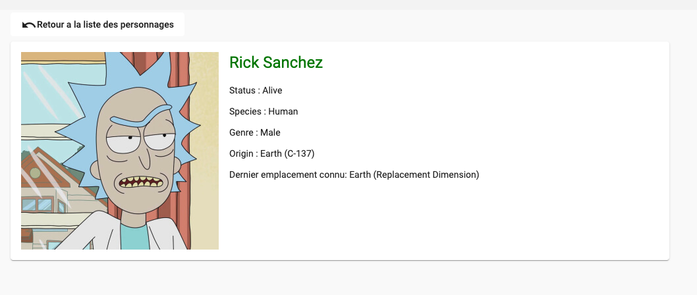
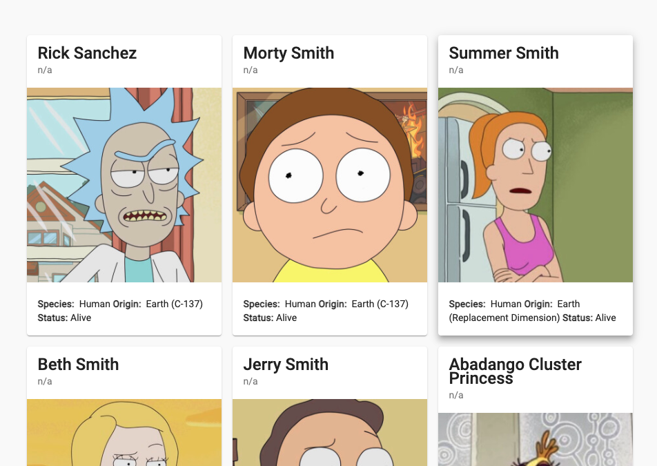
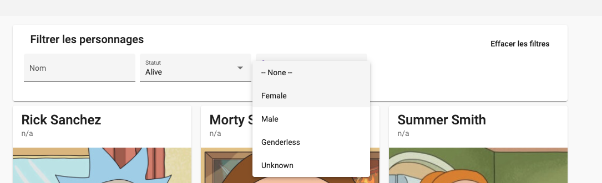

# Installation

Setup officiel de la doc angular : https://angular.io/guide/setup-local

Selon votre ordinateur il vous sera nécessaire de trouver comment installer nodejs et npm. Comme nous sommes à distance essayer de vous entraider pour que l'application démarre au prochain cours. 🙏

Introduction du cours : https://docs.google.com/presentation/d/1MPMgpwSTSjuL1MEYGJDiRHq3GPrMmGv2sEjf20kKXw8/edit?usp=sharing

Si vous avez git vous pouvez faire :
`git clone https://github.com/ThibaudAV/RickAndMorty`  
ou bien utiliser le bouton "Download ZIP" de Github

Puis ouvrir le projet `cd RickAndMorty`

Installer les dépendances et Angular avec la commande : `npm install`

Et pour executer l'application en local : `npm run start` ou `npm run ng serve --open`

Ce qui vous permet de voir l'application sur l'url http://localhost:4200/

# TD RickAndMorty


## 0 - Créer un nouveau workspace et initialiser l'application

Création du projet avec angular-cli : `ng new RickAndMorty`

```
? Do you want to enforce stricter type checking and stricter bundle budgets in the workspace? Yes
```

```
? Would you like to add Angular routing? Yes
```

Permet d'Init un module dédié au routing

```
? Which stylesheet format would you like to use? SCSS
```

Permet d'utiliser Sass. Sass est un langage qui, une fois compilée, génère le Css.

## 1 - Afficher une fiche personnage

Créer le composant : `npm run ng generate component single-character`

Ajouter le composant dans le app.component.html. Exemple :

```
<div class="container">
  <h1>Rick And Morty</h1>
  <app-single-character></app-single-character> <!-- Correspond au `selector` du component crée -->
</div>
```

Ajouter une variable avec l'objet caractère suivant dans le controller

```
character = {
    id: 1,
    name: 'Rick Sanchez',
    status: 'Alive',
    species: 'Human',
    gender: 'Male',
    location: {
      name: 'Earth',
      url: 'https://rickandmortyapi.com/api/location/20',
    },
    image: 'https://rickandmortyapi.com/api/character/avatar/1.jpeg',
    url: 'https://rickandmortyapi.com/api/character/1',
  }
```

### Ex 1:

Afficher les informations `nom`, `status`, `species`, `gender`, `location.name` du personnage

> Pour le css vous pouvez utiliser https://www.w3schools.com/howto/howto_css_cards.asp ou composer vous même le html et le css.
>
> Pour afficher une variable il faut utiliser l'interpolation : les doubles accolades `{{ }}`  
> Ce qui se trouve entre les doubles accolades correspond à l'expression TypeScript que nous voulons afficher, l'expression la plus simple étant une variable.
> Ex :
>
> ```
> <h4>{{ character.name }}</h4>
> ```

### Ex 2:

Afficher l'image du personnage

> La liaison par propriété ou "property binding" est une autre façon de créer de la communication dynamique
> entre le TypeScript et le template. Il permet de contrôler n'importe quelle propriété d'un élément du DOM
> en s'inspirant de la syntaxe native.
>
> Afin de lier cette propriété au controller TypeScript, il faut mettre la propriété entre crochets `[]` et l'associer
> à la variable
>
> Exemple pour une image ou pour désactiver un bouton :
>
> ```
> 
> <button type="button" [disabled]="!isAvailable">BUY</button>
> ```

### Ex 3:

Changer la couleur du nom du personnage si le `status` est :

- `Alive` : Vert
- `Dead` : Rouge
- `autre` : Noir

Pour tester le status, changer la valeur du `status` du personnage dans le controller.

> Avec angular vous pouvez manipuler dynamiquement les class d'un element html comme div, span ou autres avec le "property binding"  
> Ex: `[class.ma_class_css]="isClassVisible"` avec `isClassVisible = true` dans le controller  
> Il faut donc ajouter le préfix `class` suivi du nom de la class (`ma_class_css`) et l'associer à une variable de type `boolean`  
> Il est possible d'ajouter des conditions dans le binding ex: `[class.red]="color === 'red'"`

### Notes :

> ⚠ L'interpolation ne doit être utilisée que pour définir le contenu d'un élément HTML.  
> Ex : 😱 ``😱 ❌
> Préférez l'utilisation du Property Binding

> ⚠ Les expressions utilisées dans le "template interpolation" (et les "property binding") doivent rester simples.  
> Vous pouvez utiliser des méthodes de votre composant

## 2 - Afficher la liste des personnages

Créer un nouveau composant `all-characters` et ajouter le dans l'application.

Ajouter la variable ci-dessous qui contient un tableau de personnages:

```
  allCharacters = [
    {
      id: 1,
      name: 'Rick Sanchez',
      status: 'Alive',
      species: 'Human',
      gender: 'Male',
      location: {
        name: 'Earth (Replacement Dimension)',
        url: 'https://rickandmortyapi.com/api/location/20',
      },
      image: 'https://rickandmortyapi.com/api/character/avatar/1.jpeg',
      url: 'https://rickandmortyapi.com/api/character/1',
      created: '2017-11-04T18:48:46.250Z',
    },
    {
      id: 2,
      name: 'Abadango Cluster Princess',
      status: 'Alive',
      species: 'Alien',
      gender: 'Female',
      location: {
        name: 'Abadango',
        url: 'https://rickandmortyapi.com/api/location/2',
      },
      image: 'https://rickandmortyapi.com/api/character/avatar/6.jpeg',
      url: 'https://rickandmortyapi.com/api/character/6',
      created: '2017-11-04T19:50:28.250Z',
    },
    {
      id: 3,
      name: 'Summer Smith',
      status: 'Dead',
      species: 'Human',
      gender: 'Female',
      location: {
        name: 'Earth (Replacement Dimension)',
        url: 'https://rickandmortyapi.com/api/location/20',
      },
      image: 'https://rickandmortyapi.com/api/character/avatar/3.jpeg',

      url: 'https://rickandmortyapi.com/api/character/3',
      created: '2017-11-04T19:09:56.428Z',
    },
  ];
```

### Ex 1:

Afficher le premier élément de `allCharacters` dans un tableau html

| ID  | Name         | Status | Espèce | Genre |
| --- | ------------ | ------ | ------ | ----- |
| 1   | Rick Sanchez | Alive  | Human  | Male  |

### Ex 2:

Afficher tous les éléments du tableau `allCharacters` dynamiquement avec la directive structurelle `*ngFor`.

> Lorsque l'on ajoute la directive structurelle `*ngFor="let book of bookList"` à un component,
> Angular itérera l'array `bookList` et affichera un component par objet `book`.
>
> Par exemple :
>
> ```
> <ul>
>   <li *ngFor="let book of bookList">{{ book.name }}</li>
> </ul>
> ```
>
> permet de générer le dom :
>
> ```
> <ul>
>     <li>Voyage au bout de la nuit</li>
>     <li>Don Quichotte</li>
>     <li>Le Guide du voyageur galactique</li>
> </ul>
> ```

### Ex 3:

Afficher dans la console `Afficher le personnage [id de l'obj character]` lors d'un clic sur la ligne du tableau

Modifier le css pour avoir un pointeur `cursor: pointer;` et une couleur de fond sur la ligne survolée

> Avec l'interpolation et le property binding, nous pouvons communiquer depuis le code TypeScript vers le template HTML. Mais cela manque d'interaction avec l'utilisateur.
>
> Pour cela, Angular permet d'ajouter des "listeners" d'évenements DOM afin de modifier l'état de notre application ou d'envoyer des informations au serveur, par exemple.
>
> Pour ajouter des "listeners" il faut utiliser les parenthèses `()` sur une propriété et lui ajouter une méthode du controller.
>
> Exemple pour un bouton :
>
> ```
> // Template
> <button type="button" (click)="onBuy()">BUY</button>
>
> // controller
> onBuy() {
>     console.log('BUY !');
> }
> ```

### Ex 4:

En fonction de la ligne du tableau sélectionnée, afficher dans le composant `single-character` le bon personnage.

> Pour transmettre des données à un "child component", la communication avec ce dernier se passe de la même façon qu'avec les propriétés d'un élément natif. C'est à dire à l'aide du Property Binding.

Ajouter dans la page de liste `<app-single-character [character]="selectedCharacter"></app-single-character>`

Puis, faire en sorte que la variable `selectedCharacter` contienne l'objet du personnage.

> Avec le code précédent, nous obtenons l'erreur suivante :
>
> ```
>    ERROR in src/app/all-characters/all-characters.component.html:24:23 - error NG8002: Can't bind to 'character' since it isn't a known property of 'app-single-character'.
>    1. If 'app-single-character' is an Angular component and it has 'character' input, then verify that it is part of this module.
>    2. If 'app-single-character' is a Web Component then add 'CUSTOM_ELEMENTS_SCHEMA' to the '@NgModule.schemas' of this component to suppress this message.
>    3. To allow any property add 'NO_ERRORS_SCHEMA' to the '@NgModule.schemas' of this component.
>
>    24 <app-single-character [character]="selectedCharacter"></app-single-character>
>                             ~~~~~~~~~~~~~~~~~~~~~~~~~~~~~~~
>
>      src/app/all-characters/all-characters.component.ts:5:16
>        5   templateUrl: './all-characters.component.html',
>                         ~~~~~~~~~~~~~~~~~~~~~~~~~~~~~~~~~
>        Error occurs in the template of component AllCharactersComponent.
> ```

En effet, le composant `app-single-character` n'a pas de propriété `character` accessible.

Pour définir les propriétés pouvant servir d'`input` au composant, il faut utiliser le décorateur Angular `@Input()`

```
  @Input() character;
```

> Voyez ce décorateur comme un contrôle vous permettant de définir la visibilité d'une propriété d'un composant.

### Ex 5:

Utiliser la directive structurelle `*ngIf` pour afficher ou non le composant `app-single-character` si aucun personnage n'est sélectionné.

Faite en sorte que la ligne du personnage sélectionné reste avec une couleur différente, afin de savoir laquelle est sélectionnée.

> Alors que le template interpolation et le property binding permettent de modifier l'affichage et le contenu, ils ne permettent pas de modifier la structure du DOM en ajoutant ou en retirant des éléments.
>
> Pour remédier à cette limitation, Angular fournit des directives structurelles qui permettent de modifier la structure du DOM.
>
> `*ngIf` est l'une des directive structurelle les plus utilisées.

## 3 - Ajouter un service

Afin d'éviter de stocker la liste des personnages dans le composant `app-all-characters` ou `app-single-character` nous pouvons créer un service `characterService.ts`

> Pour déclarer un service Angular, il suffit de créer une classe TypeScript et de la décorer avec le décorateur @Injectable().
>
> ```
> @Injectable()
> export class CharactersRepository {
>     ...
> }
> ```
>
> Ou utiliser la cmd suivante : `npm run ng generate service services/character-repository`

### Ex 1 :

Ajouter le service avec la liste des `characters` du composant `app-all-characters` comme variable privée.
Ajouter une fonction public `getAllCharacters()` qui retourne la liste.

### Ex 2:

Utiliser le service dans le composant `app-all-characters` afin de faire appel à la fonction `getAllCharacters()` pour afficher la liste des personnages

> Vous allez devoir utiliser "Dependency Injection" d'Angular. Je vous laisse rechercher comment utiliser le service dans le composant.

### Ex 3:

Afin d'éviter de passer complètement l'obj caractère entre les 2 composants : `app-all-characters` -> `app-single-character`.
nous pouvons modifier la liaison entre les 2 composants afin de ne passer que l'`id` du personnage. Et utiliser le service pour retrouver le personnage avec son `id`.

Implémenter ce mécanisme avec l'ajout d'une fonction `getCharacterById(id:number)`

A chaque changement de l'id donné en Input() du composant `app-single-character` il sera nécesaire d'appeler la fonction `getCharacterById` pour récupèrer l'obj `character`. Pour cela 2 solutions :

- l'interface `OnChanges` d'Angular

  > La méthode `ngOnChanges`, ajoutée par l'interface `OnChanges`, est appelée lors d'un changement sur le composant. Elle présente l'avantage de pouvoir gérer plusieurs éléments en même temps. Si vous avez besoin de gérer plusieurs changements, cette méthode est à privilégier.

- utiliser un `setter` typescript sur l'Input

  > exemple d'implementation :
  >
  > ```ts
  > // Déclarer la valeur de l'élément comme un attribut privé de votre  composant.
  > private _characterId: string;
  > // Vous devez ensuite écrire un "setter" accompagné d'un "getter" dans votre composant. Le code du changement sera alors situé dans le "setter".
  > @Input()
  > set characterId(valeur: number) {
  >    this._characterId = valeur;
  >   // Insérez votre code de détection du changement ici
  > }
  > get characterId(): string {
  >   return this._characterId;
  > }
  > ```

## 4 - Ajouter des routes

L'objectif est de séparer la liste des personnages de l'affichage d'un personnage, et de permetre aux urls suivantes de fonctionner :

-> http://localhost:4200/ Affiche une page d'accueil avec un menu  
-> http://localhost:4200/characters Affiche la liste des personnages  
-> http://localhost:4200/character/1 Affiche la fiche du 1er personnage

Le Routing est le mécanisme qui permet de naviguer d'une page à une autre sur un site web.
Par exemple si vous tapez ces deux url dans votre navigateur :

- https://fr.wikipedia.org/wiki/Le_Roi_lion
- https://fr.wikipedia.org/wiki/Avengers:_Endgame
  En fonction du nom de film indiqué dans l'url, l'application Web de Wikipedia va déterminer le traitement à effectuer.
  Ce traitement permettra d'afficher la page web correspondante au film demandé (ici Le_Roi_lion ou Avengers:\_Endgame).

Dans angular le routing est donc assuré par le `RouterModule` et en ajoutant la bonne configuration à ce module. Lors de la création de l'application nous avons choisi de laisser angular initialiser le routing.
On peut donc retrouver l'init et la config du routing dans le module `AppRoutingModule` du fichier `app-routing.module.ts`

### Ex 1

À partir de la doc Angular ([ici](https://angular.io/guide/router#defining-a-basic-route)) ou toutes autres recherches google (ex: [Guide Angular Wishtack](https://guide-angular.wishtack.io/angular/routing/mise-en-place-du-routing)).

Ajouter la route permettant de retrouver la liste des personnages avec le lien http://localhost:4200/characters

### Ex 2

Ajouter la 2e route `http://localhost:4200/character/1` qui va permettre de visualiser un seul personnage en fonction de l'identifiant (dans cette url : `1`)

Pour configurer cette route, il va être nécessaire de spécifier la partie dynamique (l'identifiant) comme paramètre de la route.

Si on se rend sur cette nouvelle route, aucun personnage ne s'affiche. Il manque l'association du paramètre de la route au personnage à afficher.

Angular fournit un service `ActivatedRoute` qui décrit l'état actuel du "router".

Ajouter ce service dans `SingleCharacterComponent` et l'utiliser pour récupèrer le paramètre de la route définie.

Aidez-vous de ce qui est décrit ici : https://guide-angular.wishtack.io/angular/routing/mise-en-place-du-routing#5-acces-aux-parametres

Comme je pense que vous n'avez encore jamais vu d'Observable je vous recommande d'utiliser la propriété `snapshot`

/!\ Dans notre liste de personnages, id est un nombre.

Tester avec la route suivante : http://localhost:4200/character/2 si le bon personnage s'affiche 👏

### Ex 3

Pour naviguer d'une page à l'autre il faut ajouter des liens.
Ajouter un lien "Retour à la liste des personnages" dans le composant `SingleCharacterComponent`

Aidez-vous de ce qui est décrit ici : https://guide-angular.wishtack.io/angular/routing/mise-en-place-du-routing#4-creation-de-liens

### Ex 4

Supprimer le composant `<app-single-character></app-single-character>` dans `all-characters.component.html`

Ajouter un lien sur chaque ligne de la liste du tableau permettant de rediriger vers le bon personnage.

### Ex 5

Ajouter un composant `Home` afin d'avoir une page d'acceuil sur la route `http://localhost:4200/`

Ajouter le lien "Liste des personnages" sur cette nouvelle page.
Enfin, ajouter un lien "Retour au menu" sur la page de liste des personnages.

👏👏👏

## 5 - Utiliser l'api RickAndMorty

Doc de l'api : https://rickandmortyapi.com/documentation

Dans les parties précédentes nous avons créé un service pour stocker la liste des personnages.
Nous allons maintenant compléter ce service pour aller chercher la liste sur l'api de RickAndMorty.

> Dans une application Angular, la plupart des données proviennent d'API où les échanges de données se font via des requêtes HTTP.  
> Pour produire des requêtes HTTP, Angular fournit un service HttpClient qui est un wrapper de la classe native (et vieillissante) XMLHttpRequest. (#Ajax pour les connaiserus)

> ### HttpClient
>
> HttpClient est un service Angular. On peut donc le récupérer avec la Dependency Injection.
>
> ```js
> ...
> constructor(private httpClient: HttpClient) {
> ...
> ```
>
> Et bien sur, il faut ajouter le module associé qui référence ce service `HttpClientModule` dans les imports du module courant.

> Le service `HttpClient` met a disposition les méthodes : `get`, `delete`, `patch`, `post`, `put`, etc... .
> qui permettent de fabriquer un "`Observable`" qui réalisera le call HTTP

> Il existe 2 façons de réaliser des actions asynchrones : `Observable` ou `Promise`. Pour commencer, on va utiliser les `Promise`. Ajouter un `toPromise()` après la méthode `get`, `delete`, etc...  
> La fonction devient donc asynchrone. Vous pouvez utiliser les async/await pour plus de simplifications.

> ### Qu’est-ce que async/await ?
>
> Une fonction définie avec le mot clé `async` renvoie systématiquement une promesse : si une erreur est levée pendant l’exécution de la fonction, alors la promesse est rejetée. Sinon si une valeur est retournée, alors la promesse est résolue avec cette valeur.
> Ce comportement est comparable aux callbacks.
>
> La partie la plus intéressante est l’utilisation du mot clé `await`. `await` peut être utilisé uniquement dans une fonction `async`, et permet d’attendre la résolution d’une promesse et retourner sa valeur.

### Ex 1

Utiliser httpClient pour retourner la liste des personnages dans la methode `getAllCharacters` du `CharactersRepository`

Il faut utiliser l'endpoint : `GET https://rickandmortyapi.com/api/character` de l'[api](https://rickandmortyapi.com/documentation/#get-all-characters)

### Ex 2

Modifier la méthode `getCharacterById` pour qu'elle utilise directement le [Get a single location
](https://rickandmortyapi.com/documentation/#get-a-single-location) de l'api

### Ex 3

Pour avoir un code propre, il faut soigner les types typescript ! Jusqu'à présent, nous avons utilisé le type `any`. Nous devons donc les remplacer ou laisser l'inférence de type typescript faire son travail afin de s'assurer que le code sera fonctionnel.

Ajouter les types (types, interfaces ou class) pour :

- [Character](https://rickandmortyapi.com/documentation/#character-schema) qui correspond à l'interface de l'objet d'un seul personnage
- [Info and Pagination](https://rickandmortyapi.com/documentation/#info-and-pagination) qui correspond au résultat d'une recherche de personnages

## 6 - Utiliser Angular Material

Documentation de Angular Material : https://material.angular.io/guide/getting-started

Vous pouvez utiliser `npm run ng add @angular/material` si vous n'avez pas installé angular (`ng`) en global

> `? Choose a prebuilt theme name, or "custom" for a custom theme:` Celui de votre choix  
> `? Set up global Angular Material typography styles?` Yes  
> `? Set up browser animations for Angular Material?` Yes

Pensez à bien lire la doc si vous utilisez un [theme prédéfini](https://material.angular.io/guide/theming#using-a-pre-built-theme).

> Finally, if your app's content is not placed inside a `mat-sidenav-container` element, you need to add the `mat-app-background` `class` to your wrapper element (for example the `body`). This ensures that the proper theme background is applied to your page.

### Ex 1

Ajouter une Toolbar en haut de l'application.  
Ajouter un lien vers la home `/`.  
Ajouter un lien vers la liste des personnages `/characters`.

Rendu final à obtenir :


### Ex 2

Utiliser `<mat-card>` pour afficher les infos du personnage dans le composant `SingleCharacterComponent`

Rendu final à obtenir :


### Ex 3

Remplacer la liste de personnages par une liste de `<mat-card>` pour un meilleur affichage.

Rendu final à obtenir :


### Ex 4

Ajouter une card avec des filtres pour pouvoir rechercher des personnages. Pour le moment on fait uniquement l'affichage.

Il faut utiliser `mat-form-field` avec 1 `input` text et 2 `mat-select`.

Ajouter un bouton en haut à droite.

Rendu final à obtenir :


### Ex 5:

Ajouter `<mat-paginator>` pour afficher une pagination de la liste des personnages.

Ajouter le bon binding pour `[length]` afin d'afficher le bon total de page à partir des données de l'api.

> Le bon total est : 671

## 7 - RxJs

Changer les `Promise` + `await async` pour utiliser observable dans le service CharactersRepository

### Ex 1:

Supprimer les `await` / `async` et le `toPromise()` pour que les méthodes `getAllCharacters` et `getCharacterById` retournent un Observable.

Dans le composant `SingleCharacterComponent` remplacer le `then` par un `subscribe`.

L'application fonctionne comme avant mais elle utilise désormais des observables

### Ex 2:

Réaliser les mêmes actions pour `AllCharactersComponent`

Mais cette fois-ci, il sera nécessaire d'utiliser l'opérateur `map()` afin d'extraire uniquement la liste de résultats `results` du model `CharactersList`.

## 7 - Pipes

> Les Pipes sont des filtres utilisables directement depuis la vue afin de transformer les valeurs lors du "binding".

Ex :

```html
<div>{{ user.firstName | lowercase }}</div>
```

### Ex 1:

Angular dispose de plusieurs "pipes" natifs : https://angular.io/api?type=pipe.

En utilisant le bon pipe, afficher les noms des personnages en majuscule dans la liste.

### Ex 2:

https://angular.io/api/common/AsyncPipe

> Le `pipe async` s'abonne à un `Observable` ou à une `Promise` et renvoie la dernière valeur qu'elle a émise. Lorsqu'une nouvelle valeur est émise, le `pipe async` marque le composant afin de "l'actualiser".  
> Lorsque le composant est détruit, le `pipe async` se désabonne automatiquement pour éviter d'éventuelles fuites de mémoire.

Utiliser le `| async` afin de s'abonner directement à l'observable contenant la liste des personnages dans le composant : `AllCharactersComponent`

### Ex 2:

Faire la meme chose pour le composant : `SingleCharacterComponent`

> Pour éviter de créer de multiples souscriptions à un Observable, on peut stocker le résultat de l’appel avec `as`

Exemple de syntaxe : `<div *ngIf="asyncUser | async as user">{{ user.name }}</div>`

## 8 - Angular FormModule

https://guide-angular.wishtack.io/angular/formulaires

### Ex 1: Template-driven Forms

Utiliser `FormsModule` et avec les `[(ngModel)]="selectedValue"` rassembler les valeurs des filtres.

Ajouter un bouton valider et afficher les valeurs dans la console.

### Ex 2: Reactive Forms

Utiliser `ReactiveFormsModule` pour regrouper les valeurs du formulaire.  
Afficher les valeurs dans la console en utilisant l'observable `valueChanges` afin d'afficher le log à chaque fois que la valeur d'un input change.

https://angular.io/guide/reactive-forms

## 9 - Les sorties avec Output()

Le composant `AllCharactersComponent` peut être découpé afin de sortir la carte des filtres dans un autre composant.

Créer un composant spécifique pour les filtres de personnages `CharacterSearchBarComponent`(`character-search-bar.ts`)

Ajouter ce composant dans le composant `AllCharactersComponent`

Nous avons besoin de faire communiquer le nouveau composant `CharacterSearchBarComponent` avec `AllCharactersComponent` afin de pouvoir passer les filtres de recherche au repository.

Déclarer une variable qui va représenter le fournisseur d’événement avec une nouvelle instance de `EventEmitter`. Et ajout de la déclaration @Output() comme suit :

```ts
@Output()
myHero = new EventEmitter<Hero>();
```

> En fait, nous ajoutons ici un custom événement, comme il existe actuellement le `(click)="..."` sur un bouton.

Grâce à notre paramétrage, nous allons pouvoir, depuis la Vue du Component Parent, nous attacher à l’événement crée par `@Output()` et `EventEmitter`

Et cela s’écrit comme pour l’attachement à un click sur un bouton :

```html
<app-hero-add (myHero)="selectHero($event)"></app-hero-add>
```

Afin d'émettre des événements lors d'un changement dans le formulaire nous devons appeler la fonction `emit()` de `EventEmitter`

Ex : `myHero.emit({ avatar: '🦊' })`

## 10 Filtrer les personnages

Passer les valeurs de la barre de recherche à la méthode `getAllCharacters()` afin de filtrer les resultas dynamiquement.
